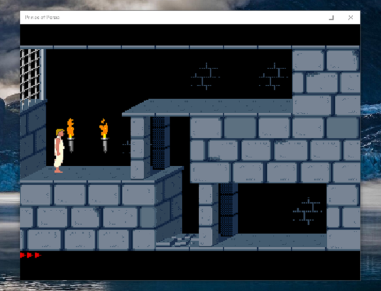

# SDLPop 1.0.10 - main branch

SDL2 + SDL2_Image + SDLPop ported to W10M 10240. 

## About UWP SDLPoP
An open-source port of Prince of Persia to Xbox One and Series consoles via UWP, based on the disassembly of the DOS version, extended with new features.

## Screnshots

# Status
- Game resources data auto-loading fixed (I hope)
- With help of "Trae" AI (hello, ByteDance!), mouse & touchpanel game input parttially added 
- Game runs ok but there are some problems to save\restore settings (.ini file error?) when I tested it on my PC 

## TODO
- Add full touchscreen game input (and, may,be mouse too).
- Fix settings seve/restore bug(s). 

## Useful links
Forum board: https://forum.princed.org/viewforum.php?f=126

GitHub: https://github.com/NagyD/SDLPoP

Compiled versions: https://www.popot.org/get_the_games.php?game=SDLPoP

## Authors
Author: David from forum.princed.org (NagyD on GitHub)

Contributors: (Usernames refer to forum.princed.org or GitHub.)

- Andrew (bug reports)
- htamas (inspiration, dungeon wall drawing algorithm, bug reports)
- Norbert (EndeavourAccuracy on GitHub) (bug reports, suggestions, improved gamepad support)
- musa (bug reports)
- Eugene (bug reports)
- StaticReturn (Mac OS X: Makefile (for older SDL1 version), bug reports)
- Poirot (ecalot on GitHub) (Mac OS X: Now compatible with Falcury SDL2 port)
- kees (bugfixes)
- Falcury (porting to SDL2; quicksave improvements; replay files; 
SDLPoP.ini: added basic support and constantly adding new options;
mod folders; fake tiles; readable sequence table; CMake support;
pause menu; MIDI support;
and various other bugfixes, improvements, additions)
- segra (segrax on GitHub) (Joystick support, resizable window)
- DarkPrince (bug reports)
- Andrey Vasilkin / digi@os2.snc.ru (eComStation (OS/2) support)
- mfn (fixed a small bug when USE_MIXER is undefined)
- diddledan (Visual C++ (NMake) support)
- zaps166 (small Makefile fixes)
- usineur (faster music loading)
- yaqxsw (icon)

## GENERAL INFO
What is this?

This is an open-source port/conversion of the DOS game Prince of Persia. It is based on the disassembly of the original PoP1 for DOS.

Note, however, that SDLPoP has many new features not found in the original game. 
These are marked as such in the command-line and the keys sections below.

More tech. details you can find here:
https://github.com/mediaexplorer74/SDLPoP/wiki

## ..

AS IS. SDLPoP is SDL RnD only, not for gaming. 

## .
-- [m][e] June, 25 2025

