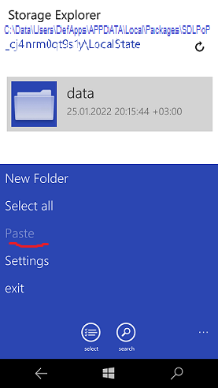

# SDLPop

SDL2+SDL2_Image Port to W10M 15063 (Game "P.o.P." is not interested for me, it was used only for RnD) 

## Shots

## 2 words about it
C++ is not easy thing...
But C++ gives some special features for all solutions (UWP, and so on)...

SDL is Simple DirectMedia Layer.

I need to incorporate this thing in Emulation-depandent projects.  

-- me 2022
