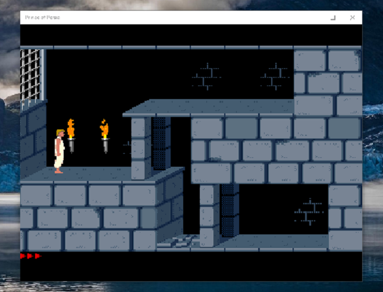
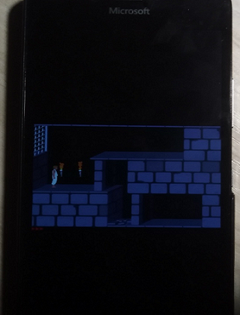

# SDLPop 1.0.8

SDL2+SDL2_Image Port to W10M 15063 (Game "P.o.P." is not interested for me, it was used only for RnD) 

## About UWP SDLPoP
An open-source port of Prince of Persia to Xbox One and Series consoles via UWP, based on the disassembly of the DOS version, extended with new features.

## Shots

## Plan of your own RnD
1. Download appx and install it at your winphone

2. Download "data" folder, unzip and transfer it form PC to your phone

3. Use some cool File Explorer (I used Storage Explorer for my parttially unlocked Lumia 950, 
   because of this great tool sees whole filesystem!) and place /data at:

   C:\Data\Users\DefApps\APPDATA\Local\Packages\SDLPoP_cj4nrm0qt9s1y\LocalState\

4. Try to run the game.

5. Explore the settings.

6. Inspect the quolity of graphics, sounds, game speed, etc...

7. Try to control the prince... ;)

## Useful links
Forum board: https://forum.princed.org/viewforum.php?f=126

GitHub: https://github.com/NagyD/SDLPoP

Compiled versions: https://www.popot.org/get_the_games.php?game=SDLPoP

## Authors
Author: David from forum.princed.org (NagyD on GitHub)

Contributors: (Usernames refer to forum.princed.org or GitHub.)

- Andrew (bug reports)
- htamas (inspiration, dungeon wall drawing algorithm, bug reports)
- Norbert (EndeavourAccuracy on GitHub) (bug reports, suggestions, improved gamepad support)
- musa (bug reports)
- Eugene (bug reports)
- StaticReturn (Mac OS X: Makefile (for older SDL1 version), bug reports)
- Poirot (ecalot on GitHub) (Mac OS X: Now compatible with Falcury SDL2 port)
- kees (bugfixes)
- Falcury (porting to SDL2; quicksave improvements; replay files; 
SDLPoP.ini: added basic support and constantly adding new options;
mod folders; fake tiles; readable sequence table; CMake support;
pause menu; MIDI support;
and various other bugfixes, improvements, additions)
- segra (segrax on GitHub) (Joystick support, resizable window)
- DarkPrince (bug reports)
- Andrey Vasilkin / digi@os2.snc.ru (eComStation (OS/2) support)
- mfn (fixed a small bug when USE_MIXER is undefined)
- diddledan (Visual C++ (NMake) support)
- zaps166 (small Makefile fixes)
- usineur (faster music loading)
- yaqxsw (icon)

## GENERAL INFO
What is this?

This is an open-source port/conversion of the DOS game Prince of Persia. It is based on the disassembly of the original PoP1 for DOS.

Note, however, that SDLPoP has many new features not found in the original game. 
These are marked as such in the command-line and the keys sections below.

More tech. details you can find here:
https://github.com/mediaexplorer74/SDLPoP/wiki

AS IS. SDLPoP is SDL RnD only, not for gaming. 

-- [m][e] 2022
